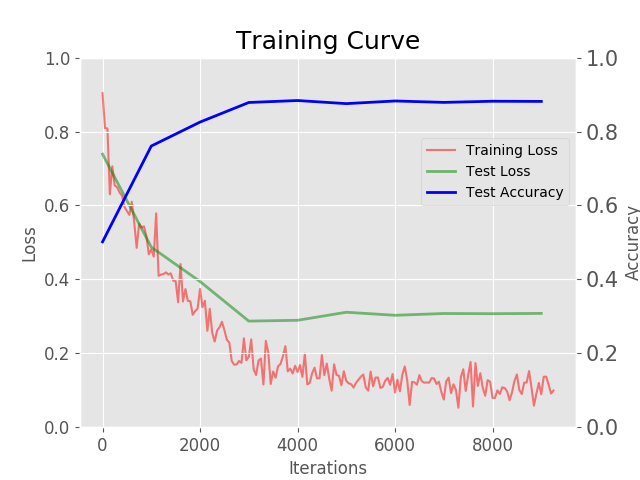
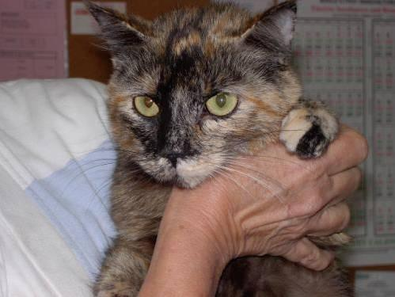
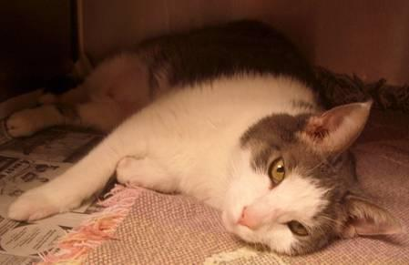
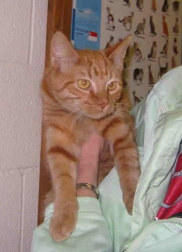

# Caffes and Dogs

Using Caffe to train an ImageNet-based model to recognize images of cats and dogs.
Uses a training dataset provided by Asirra via Kaggle.

## Training

Run on an AWS EC2 Machine with Ubuntu 16.04 built off a Deep Learning AMI.
Caffe with Python 2.7.

Run with:
```
/home/ubuntu/src/caffe_python_2/build/tools/caffe train --solver /mnt/git/caffes-and-dogs/caffe_models/caffe_model_1/solver_1.prototxt 2>&1 /mnt/git/caffes-and-dogs/caffe_models/caffe_model_1/model_1_train.log &
```

See how training improved against the validation set over time:


## Predictions

See submission CSVs in the `input/` folder named after each test dataset. For example the final model was able to classify the following images:

| Image                                   | Dataset  | Classification |
| --------------------------------------- | -------- | --------------:|
|  | Skoltech | Cat            |
|  | Skoltech | Dog            |
|  | Skoltech | Cat            |
